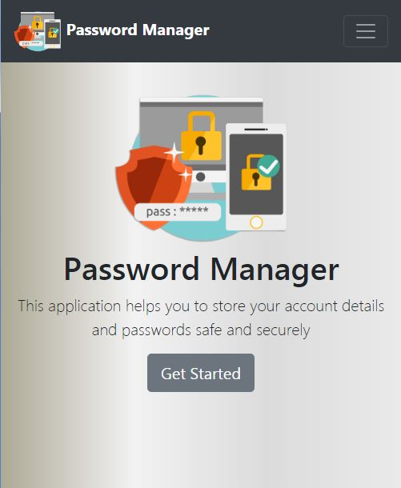

# Password Manager
Password Manager is a flask app which helps you to keep your account details safe, secure, and accessible.  
Password Manager does an amazing job of storing your account information.

## Database
Database file is not included in this GitHub repo, so you will have to create it by yourself.   
   
DB_Name - "pass_locker"    

Table_Name - 
"accountdetails" (sno(int),site(varchar),username(varchar),password(varchar(1000)))   
"user_details" (u_id(int),email_id(varchar),password(varchar),plain_pass(varchar))

`This Application is still in Development Phase.`